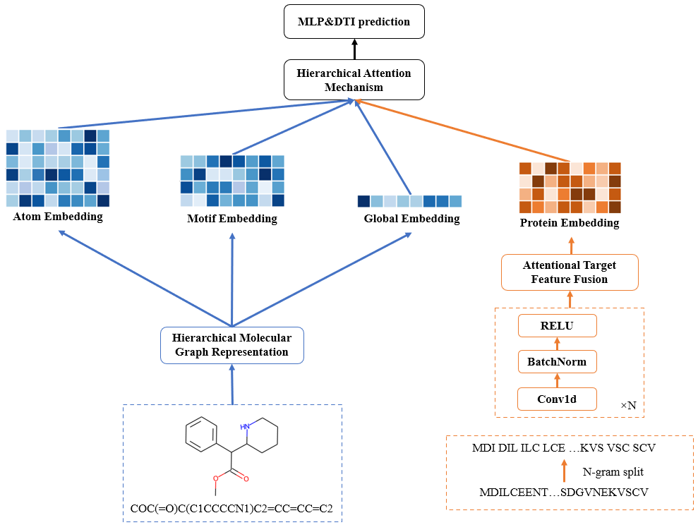

# **HiGraphDTI: Hierarchical Graph Representation Learning for Drug-Target Interaction Prediction**

## HiGraphDTI

+ The code for the paper "HiGraphDTI: Hierarchical Graph Representation Learning for Drug-Target Interaction Prediction".
+  **HiGraphDTI** learns hierarchical drug representations from triple-level molecular graphs to thoroughly exploit chemical information embedded in atoms, motifs, and molecules. Then, an attentional feature fusion module incorporates information from different receptive fields to extract expressive target features. Last, the hierarchical attention mechanism identifies crucial molecular segments, which offers complementary views for interpreting interaction mechanisms. The overview architecture of HiGraphDTI is shown as follows.



## Requirements

+ python >= 3.6.9
+ torch >= 1.10.1
+ RDkit >= 2021.9.4
+ numpy >= 1.19.5
+ pandas >= 1.1.5


## Usage

### Training on datasets used in this paper

#### Data and file directory preparation

+ Before training a model on the datasets used in this paper, we prepare data and file directory as follows: 
  + Create a local directory for the dataset, such as data/human/raw.
  + Download the raw datasets from <a herf='https://doi.org/10.1093/bioinformatics/btaa524](https://github.com/lifanchen-simm/transformerCPI/tree/master'> TransformerCPI  repository</a> and put them into the corresponding folders.
  + Convert the data storage format to a CSV file with column names 'smiles', 'sequence' and 'interaction'.  We take the Human dataset as an example shown in the data/human/raw/data_process.py. Specifically, for the GPCR dataset, we randomly selected 20% of the training set as the validation set.

#### Training 

+ For Human and C.elegans datasets, run the command as follows:

  ```
  python fold5_main.py
  ```

+ For BingdingDB and GPCR, run the command as follows:

  ```
  python main.py
  ```

  

